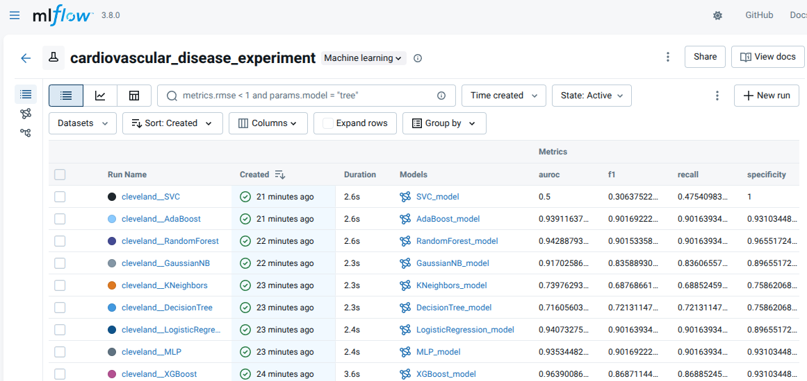
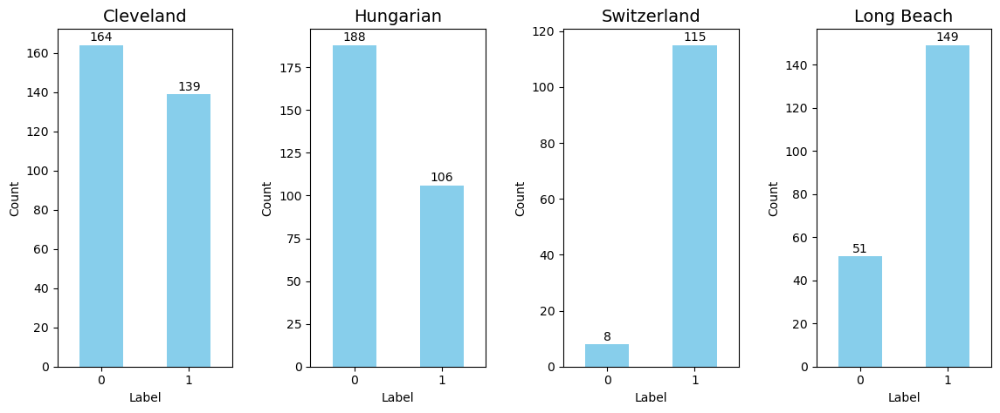
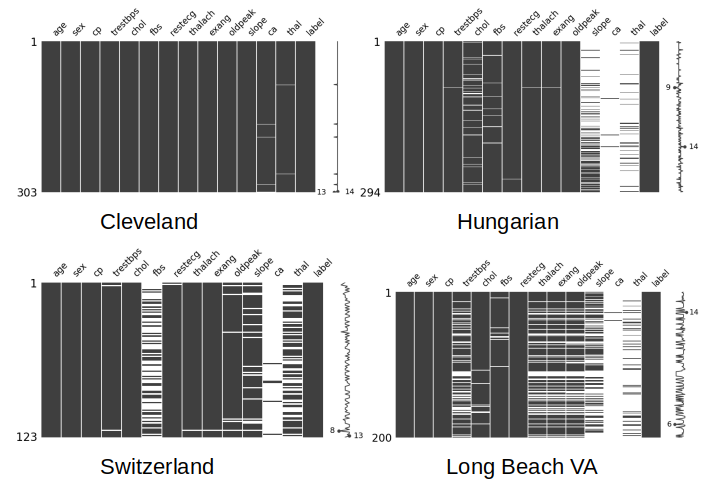
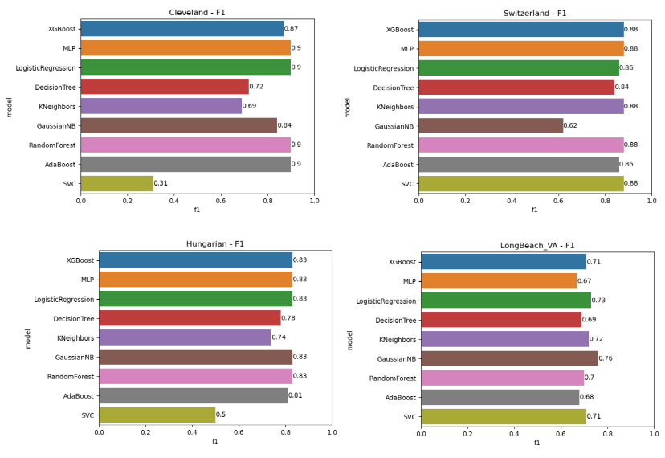
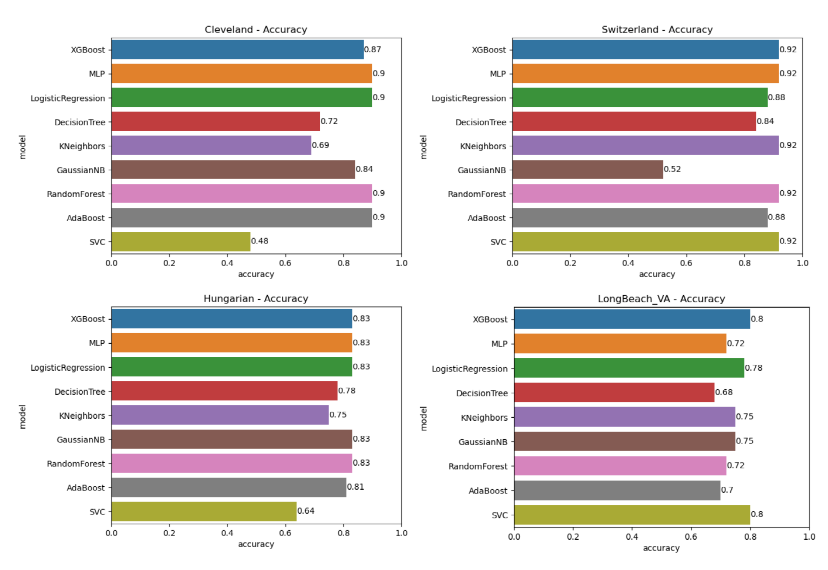
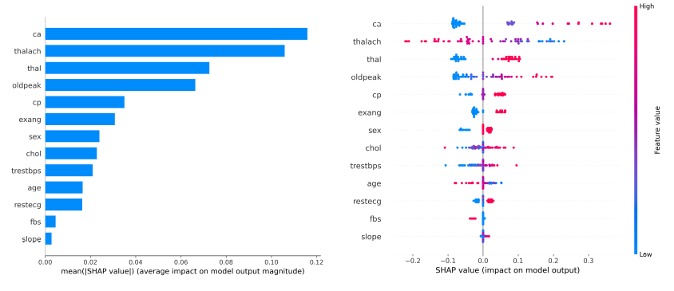

# Heart Disease Prediction: Binary Classification (Multi-Dataset Study)

## Project Overview

Comparison of performance of various ML models on **binary classification of cardiovascular disease (CVD)** using four distinct public datasets. The primary goal is to explore mutiple heart disease datasets and to assess perfomance of various traditional ML models on these datasets.

### Classification Goal

* **Binary Target:** `0` (No CVD / Healthy) or `1` (At Risk / Presence of CVD).
* **Original Data Adjustment:** Except Hungarian dataset, all three datasets initially contained multi-class risk levels (1-4). These have been merged into a single binary class (`1`) to focus solely on the presence or absence of the disease.


## Experiment Tracking (MLflow)

This project uses **MLflow Tracking** to log:
- parameters (dataset, model type, hyperparameters)
- metrics (accuracy, f1, precision, recall, AUROC, specificity)
- artifacts (predictions, confusion matrix, explainability plots)
- models (sklearn + XGBoost)

[github[GitHub · Change is constant. GitHub keeps you ahead. · GitHub](https://github.com/)b.com/darshanz/ML-for-Cardiovascular-Disease-Diagnosis.git)) the performance of various traditional Machine Learning (ML) models for the binary classification of cardiovascular disease (CVD). The comparison is conducted using four distinct, publicly available heart disease datasets to assess model efficacy across diverse data sources.](https://github.com/darshanz/ML-for-Cardiovascular-Disease-Diagnosis.git)
## How to Run

### Prerequisites

* Python 3.8+
* Jupyter Notebook or JupyterLab
* Dataset is assumed to be placed in `data/downloaded/` folder in the parent directory of this repo (this repo and data are in the same directory level).


1.  **Clone the repository:**
    ```bash
    git clone https://github.com/darshanz/ML-for-Cardiovascular-Disease-Diagnosis.git
    ML-for-Cardiovascular-Disease-Diagnosis.git
    ```
 
2.  **Install dependencies:**
    ```bash
    pip install -r requirements.txt
    ``` 

3.  **Run Experiments:**
     
     1. Data Exploration and Missing Valie Imputation (Notebook)
     2. Data Preparation for Training
     3. Experiment scripts
    ```bash
        cd src
        python main.py
    ```
     
4.  **Run Experiments:**
    ```bash
    mlflow server --backend-store-uri sqlite:///cardiovascular.db --port 5000

    ```



## Datasets Used

This project utilizes four well-known heart disease datasets, which were combined for comprehensive evaluation:

| Dataset Name | Source Location | Total Rows | Target Class Balance (Approx.) | Notes |
| :--- | :--- | :--- | :--- | :--- |
| **Cleveland** | Cleveland Clinic Foundation | 303 | ~54% Healthy / 46% Risk | Commonly used for benchmarking. |
| **Hungarian** | Hungarian Institute of Cardiology | 294 | ~62% Healthy / 38% Risk | Contains a high number of missing values. |
| **Switzerland** | University Hospital, Zurich | 123 | ~54% Healthy / 46% Risk | Smaller, unique patient group. |
| **Long Beach** | V.A. Medical Center, Long Beach | 200 | ~62% Healthy / 38% Risk | Used to evaluate external validity. |
 
Dataset downloaded from : https://archive.ics.uci.edu/dataset/45/heart%2Bdisease?

Data Source Information:
   - (a) Creators: 
       -- 1. Hungarian Institute of Cardiology. Budapest: Andras Janosi, M.D.
       -- 2. University Hospital, Zurich, Switzerland: William Steinbrunn, M.D.
       -- 3. University Hospital, Basel, Switzerland: Matthias Pfisterer, M.D.
       -- 4. V.A. Medical Center, Long Beach and Cleveland Clinic Foundation:
             Robert Detrano, M.D., Ph.D.
   - (b) Donor: David W. Aha (aha@ics.uci.edu) (714) 856-8779   
   - (c) Date: July, 1988


 ## Methodology and Key Steps

### 1. Data Preprocessing & Cleaning

 
#### **Data Cleaning**
* The data was available in both raw and processed form with 13 features which were common in all 4 datasets, we used the 13-feature processed version of the dataset.

#####  Attribute Information

| Index | Feature Name | Description | Value Interpretation |
| :---: | :--- | :--- | :--- |
| 1 | `age` | Age in years | - |
| 2 | `sex` | Sex | `1` = Male; `0` = Female |
| 3 | `cp` | Chest pain type | `1` = Typical angina, `2` = Atypical angina, `3` = Non-anginal pain, `4` = Asymptomatic |
| 4 | `trestbps` | Resting blood pressure (mm Hg on admission) | - |
| 5 | `chol` | Serum cholestoral (mg/dl) | - |
| 6 | `fbs` | Fasting blood sugar > 120 mg/dl | `1` = True; `0` = False |
| 7 | `restecg` | Resting electrocardiographic results | `0` = Normal, `1` = ST-T wave abnormality, `2` = Probable or definite left ventricular hypertrophy |
| 8 | `thalach` | Maximum heart rate achieved | - |
| 9 | `exang` | Exercise induced angina | `1` = Yes; `0` = No |
| 10 | `oldpeak` | ST depression induced by exercise relative to rest | - |
| 11 | `slope` | The slope of the peak exercise ST segment | `1` = Upsloping, `2` = Flat, `3` = Downsloping |
| 12 | `ca` | Number of major vessels (0-3) colored by flourosopy | - |
| 13 | `thal` | Thalassemia | `3` = Normal; `6` = Fixed defect; `7` = Reversable defect |
| 14 | `num` (Target) | Diagnosis of heart disease (Angiographic status) | `0` = < 50% diameter narrowing (No disease); `1` = > 50% diameter narrowing (Disease) |


* The raw data files, which lacked headers, were loaded and assigned clear, descriptive column names based on the UCI dataset dictionary.
* The non-standard missing value placeholder (`?`) was converted to the standard `NaN` to ensure correct handling by pandas.

##### Label Distribution in Four Datasets




#### **Handling Missing Values (Two-Pronged Approach)**

##### Missing Values in four datasets


Missing values were categorized into two types: Random Missing Values (RMV) and Systematic Missing Values (SMV).

* **Systematic Missing Values (SMV):**
    * For the Hungarian, Switzerland, and Long Beach VA datasets (which showed high systematic missingness), the **Attribute Deletion for Missing Value Handling (ADMVH)** technique was applied.
    * Any column missing **more than 50%** of its data was **removed** from the analysis to preserve data quality.

* **Random Missing Values (RMV):**
    * For the Cleveland dataset, and the remaining attributes of the hybrid datasets, the **Most Common Missing Value Imputation (MCMVI)** method was used.
    * Remaining `NaN` values were imputed using the **mode** (most frequent value) of their respective column.

 
### 2. Exploratory Data Analysis (EDA)
* **Missingness Visualization:** Used the `missingno` library (matrix, bar, and heatmaps) to visualize and compare missing data patterns across the four datasets.
* **Interactive Controls:** Implemented `ipywidgets` to dynamically switch between dataset views for comparison.

### 3. Model Training and Evaluation

Various established machine learning algorithms were used for classifications including ensemble methods like XGBoost and Random Forest, deep learning approaches like MLP, and classical models such as Logistic Regression and Support Vector Classifier (SVC). 
 
### 4. Results

### Cleveland
| model              | accuracy   | auroc   | f1   | precision   | recall   | specificity   |
|:-------------------|:-----------|:--------|:-----|:------------|:---------|:--------------|
| XGBoost            | 0.87       | 0.96    | 0.87 | 0.88        | 0.87     | 0.93          |
| MLP                | 0.90       | 0.94    | 0.90 | 0.90        | 0.90     | 0.93          |
| LogisticRegression | 0.90       | 0.94    | 0.90 | 0.90        | 0.90     | 0.90          |
| DecisionTree       | 0.72       | 0.72    | 0.72 | 0.72        | 0.72     | 0.76          |
| KNeighbors         | 0.69       | 0.74    | 0.69 | 0.70        | 0.69     | 0.76          |
| GaussianNB         | 0.84       | 0.92    | 0.84 | 0.84        | 0.84     | 0.90          |
| RandomForest       | 0.90       | 0.94    | 0.90 | 0.91        | 0.90     | 0.97          |
| AdaBoost           | 0.90       | 0.94    | 0.90 | 0.90        | 0.90     | 0.93          |
| SVC                | 0.48       | 0.50    | 0.31 | 0.23        | 0.48     | 1.00          |
---------------------------------
### Hungarian
| model              | accuracy   | auroc   | f1   | precision   | recall   | specificity   |
|:-------------------|:-----------|:--------|:-----|:------------|:---------|:--------------|
| XGBoost            | 0.83       | 0.92    | 0.83 | 0.83        | 0.83     | 0.92          |
| MLP                | 0.83       | 0.90    | 0.83 | 0.84        | 0.83     | 0.84          |
| LogisticRegression | 0.83       | 0.92    | 0.83 | 0.83        | 0.83     | 0.87          |
| DecisionTree       | 0.78       | 0.81    | 0.78 | 0.79        | 0.78     | 0.79          |
| KNeighbors         | 0.75       | 0.75    | 0.74 | 0.74        | 0.75     | 0.84          |
| GaussianNB         | 0.83       | 0.92    | 0.83 | 0.84        | 0.83     | 0.82          |
| RandomForest       | 0.83       | 0.91    | 0.83 | 0.83        | 0.83     | 0.87          |
| AdaBoost           | 0.81       | 0.90    | 0.81 | 0.82        | 0.81     | 0.84          |
| SVC                | 0.64       | 0.53    | 0.50 | 0.41        | 0.64     | 1.00          |
---------------------------------
### Markdown for Switzerland
| model              | accuracy   | auroc   | f1   | precision   | recall   | specificity   |
|:-------------------|:-----------|:--------|:-----|:------------|:---------|:--------------|
| XGBoost            | 0.92       | 0.50    | 0.88 | 0.85        | 0.92     | 0.00          |
| MLP                | 0.92       | 0.43    | 0.88 | 0.85        | 0.92     | 0.00          |
| LogisticRegression | 0.88       | 0.39    | 0.86 | 0.84        | 0.88     | 0.00          |
| DecisionTree       | 0.84       | 0.46    | 0.84 | 0.84        | 0.84     | 0.00          |
| KNeighbors         | 0.92       | 0.28    | 0.88 | 0.85        | 0.92     | 0.00          |
| GaussianNB         | 0.52       | 0.48    | 0.62 | 0.86        | 0.52     | 0.50          |
| RandomForest       | 0.92       | 0.57    | 0.88 | 0.85        | 0.92     | 0.00          |
| AdaBoost           | 0.88       | 0.52    | 0.86 | 0.84        | 0.88     | 0.00          |
| SVC                | 0.92       | 0.72    | 0.88 | 0.85        | 0.92     | 0.00          |
---------------------------------
### Longbeach VA
| model              | accuracy   | auroc   | f1   | precision   | recall   | specificity   |
|:-------------------|:-----------|:--------|:-----|:------------|:---------|:--------------|
| XGBoost            | 0.80       | 0.55    | 0.71 | 0.64        | 0.80     | 0.00          |
| MLP                | 0.72       | 0.65    | 0.67 | 0.63        | 0.72     | 0.00          |
| LogisticRegression | 0.78       | 0.72    | 0.73 | 0.72        | 0.78     | 0.12          |
| DecisionTree       | 0.68       | 0.58    | 0.69 | 0.72        | 0.68     | 0.38          |
| KNeighbors         | 0.75       | 0.61    | 0.72 | 0.69        | 0.75     | 0.12          |
| GaussianNB         | 0.75       | 0.75    | 0.76 | 0.77        | 0.75     | 0.50          |
| RandomForest       | 0.72       | 0.61    | 0.70 | 0.68        | 0.72     | 0.12          |
| AdaBoost           | 0.70       | 0.47    | 0.68 | 0.67        | 0.70     | 0.12          |
| SVC                | 0.80       | 0.44    | 0.71 | 0.64        | 0.80     | 0.00          |
---------------------------------


Overall results show that ensemble methods and deep learning models were the most effective, with RandomForest, MLP, and XGBoost consistently achieving the highest accuracy, such as $0.90$ on the cleveland dataset and $0.83$ on the hungarian dataset, alongside strong AUROC values. Performance varied significantly across datasets; the switzerland dataset, in particular, presented a unique challenge where most models, including top performers like XGBoost and MLP, achieved high accuracy but failed to classify the minority class, evidenced by a specificity of $0.00$. Conversely, the longbeach_va dataset saw generally lower results across all metrics, with GaussianNB and LogisticRegression offering the most balanced performance in this group with AUROC values up to $0.75$ and $0.72$, respectively. Across all trials, the SVC model demonstrated the greatest inconsistency, delivering the lowest accuracy of $0.48$ on the cleveland dataset and frequently yielding the lowest F1 scores among all tested classifiers.

```
LIMITATIONS: 
- Amount of missing data could be the reason for low performance. Simple imputation methods were not sufficient. 
- Also the hyperparameters could be better optimized the selected hyperparameters were not backed by sufficient imperical study. 
- Next step: Use more sophisticated missing data imputaton techniques and apply hyperparameter optimization techniques

```


#### F1 Score



#### Accuracy



##### SHAP Summary Plot (Cleveland - MLP model)



The SHAP summary plot illustrates the feature importance and impact on the MLP model's output for the cleveland dataset, clearly indicating that features like `CA` and `Thal` have the strongest influence on the prediction. For instance, high values of CA and certain values of Thal (likely the 'fixed defect' or 'reversable defect' encodings) primarily drive the model towards a positive prediction (presence of heart disease).

